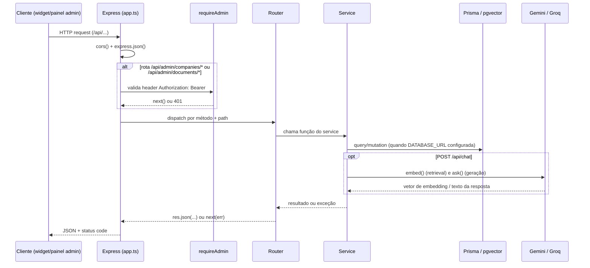
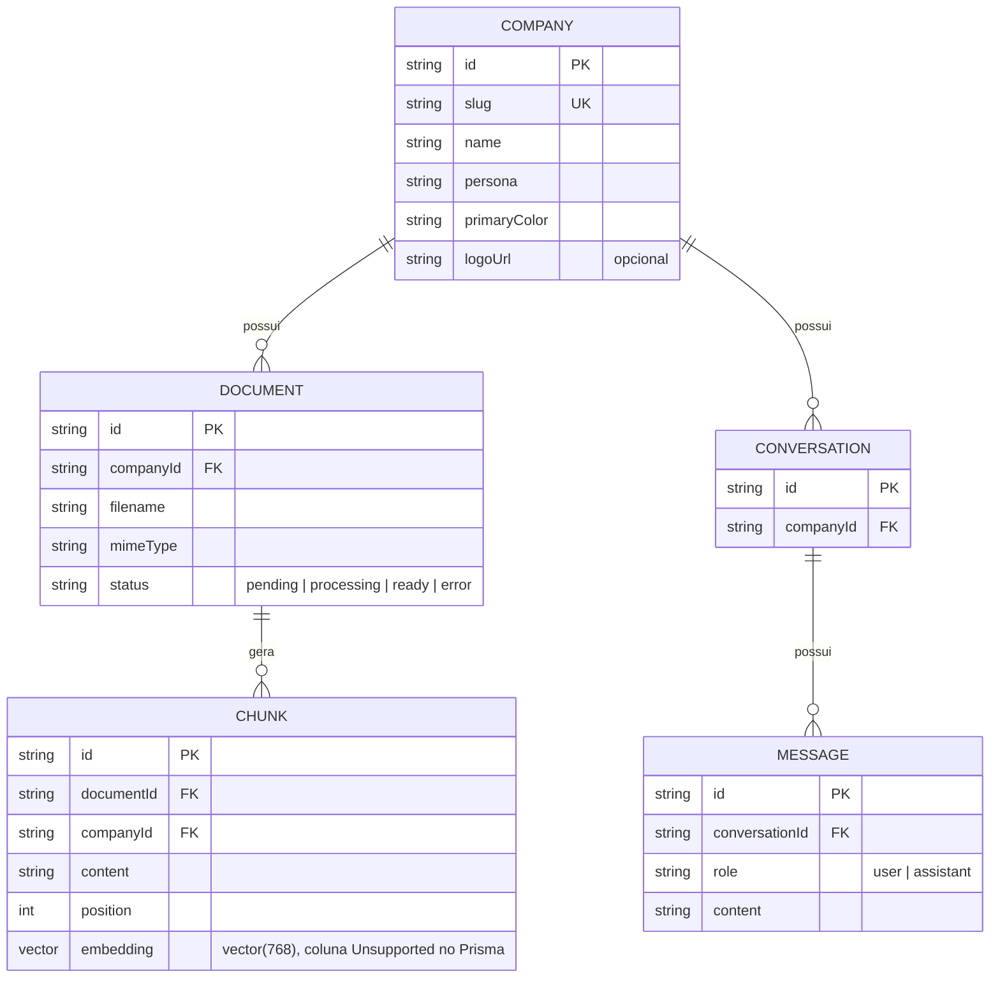

# Backend — API do Assistente IA Multiempresa

API REST em Express que resolve a persona de cada empresa, executa a busca RAG sobre os documentos cadastrados e gera a resposta via Google Gemini (com fallback para Groq). Veja a visão geral do produto e como subir o projeto inteiro no [README raiz](../README.md).

## Índice

- [Arquitetura interna](#arquitetura-interna)
- [Modelo de dados](#modelo-de-dados)
- [Referência da API](#referência-da-api)
- [Autenticação e autorização](#autenticação-e-autorização)
- [Regras de negócio](#regras-de-negócio)
- [Erros](#erros)
- [Integrações externas](#integrações-externas)
- [Rodando isoladamente](#rodando-isoladamente)
- [Testes](#testes)
- [Observabilidade](#observabilidade)

## Arquitetura interna

```
src/
├── app.ts                 # monta o Express: cors, json parser, rotas, 404, error middleware
├── server.ts               # entrypoint: cria o app e escuta em env.port
├── lib/
│   ├── env.ts               # leitura centralizada de process.env (única leitura fora deste arquivo)
│   └── prisma.ts            # PrismaClient singleton (lança erro se DATABASE_URL ausente)
├── middlewares/
│   ├── auth.middleware.ts   # requireAdmin — valida o JWT do painel admin
│   └── error.middleware.ts  # HttpError + handler central de erro (formato { error })
├── routes/                  # um router por recurso, monta em /api via app.ts
└── services/                 # regra de negócio e acesso a dados/IA, sem conhecimento de HTTP
```

Cada rota delega toda a lógica para um `service`; os routers só validam a forma da requisição, chamam o service e traduzem o resultado (ou uma exceção) em resposta HTTP. Nenhum service importa Express — por isso os services são testados diretamente, sem subir servidor.



## Modelo de dados

Definido em `prisma/schema.prisma`, PostgreSQL com a extensão `pgvector` (habilitada por `backend/docker/init-pgvector.sql`). As migrations vivem em `prisma/migrations/` e são aplicadas com `npx prisma migrate dev` (desenvolvimento) — não há script de migração para produção configurado neste repositório (nem `prisma migrate deploy` em nenhum script do `package.json` ou do CI).



- `Company` é a raiz do isolamento multi-tenant: toda consulta de contexto (`retrieveContext`) filtra por `companyId`, e o `onDelete: Cascade` em `Document`/`Conversation` garante que apagar uma empresa remove seus documentos, chunks e conversas.
- `Chunk.embedding` é do tipo `vector(768)` do pgvector. O Prisma não modela esse tipo nativamente (`Unsupported("vector(768)")`), então toda leitura/escrita de embedding usa `$queryRaw`/`$executeRaw` (ver `retrieval.service.ts` e `ingest.service.ts`), nunca o client gerado.
- `Conversation` e `Message` existem no schema e na migration, mas nenhuma rota ou service deste repositório lê ou grava nessas tabelas — o histórico de chat trafega só no corpo da requisição (`history`) e não é persistido (ver "Lacunas encontradas" na resposta do chat que acompanha esta documentação).

## Referência da API

Todas as respostas são JSON. Endpoints em `/api/admin/*` (exceto login) exigem o header `Authorization: Bearer <token>` — ver [Autenticação e autorização](#autenticação-e-autorização).

### Sistema

| Método | Rota | Auth | Descrição |
|---|---|---|---|
| GET | `/api/health` | não | Status do processo |

```
GET /api/health

200 OK
{ "status": "ok", "uptime": 42, "timestamp": "2026-07-31T12:00:00.000Z" }
```

### Empresas (público)

| Método | Rota | Auth | Descrição |
|---|---|---|---|
| GET | `/api/companies` | não | Lista as empresas atendidas (dados públicos de marca) |

```
GET /api/companies

200 OK
{ "companies": [{ "slug": "technova", "name": "TechNova Eletronicos", "primaryColor": "#2563eb", "logoUrl": null }] }
```

### Chat (público)

| Método | Rota | Auth | Descrição |
|---|---|---|---|
| POST | `/api/chat` | não | Envia uma pergunta e recebe a resposta da IA, opcionalmente com histórico e contexto RAG |

```
POST /api/chat
Content-Type: application/json

{
  "companySlug": "technova",
  "question": "Voces entregam em Curitiba?",
  "history": [{ "role": "user", "content": "Oi" }, { "role": "assistant", "content": "Ola! Como posso ajudar?" }]
}
```

- `companySlug`: opcional, assume `"technova"` se omitido.
- `question`: obrigatória, string, até 2000 caracteres após normalizar espaços.
- `history`: opcional, até 30 mensagens, cada uma com `role` (`"user"` ou `"assistant"`) e `content` (string não vazia, até 2000 caracteres).

```
200 OK
{
  "company": "technova",
  "question": "Voces entregam em Curitiba?",
  "answer": "Sim! Entregamos em Curitiba em ate 2 dias uteis...",
  "createdAt": "2026-07-31T12:00:00.000Z"
}
```

Erros: `400` (pergunta/histórico inválidos), `404` (`companySlug` não corresponde a nenhuma empresa).

### Autenticação do admin

| Método | Rota | Auth | Descrição |
|---|---|---|---|
| POST | `/api/admin/login` | não | Autentica o administrador único e retorna um JWT |

```
POST /api/admin/login
Content-Type: application/json

{ "email": "admin@example.com", "password": "senha-em-texto-puro" }

200 OK
{ "token": "eyJhbGciOiJIUzI1NiIs..." }
```

Erros: `400` (email/senha ausentes ou não-string), `401` (email ou senha não conferem com `ADMIN_EMAIL`/`ADMIN_PASSWORD_HASH`).

### Empresas (admin)

| Método | Rota | Auth | Descrição |
|---|---|---|---|
| GET | `/api/admin/companies` | JWT | Lista todas as empresas, com `documentCount` |
| POST | `/api/admin/companies` | JWT | Cria uma empresa |
| GET | `/api/admin/companies/:slug` | JWT | Detalha uma empresa |
| PUT | `/api/admin/companies/:slug` | JWT | Atualiza campos de uma empresa (parcial) |
| DELETE | `/api/admin/companies/:slug` | JWT | Remove a empresa (e, em cascata, seus documentos/chunks/conversas) |

```
GET /api/admin/companies
Authorization: Bearer <token>

200 OK
{ "companies": [{ "id": "cl...", "slug": "technova", "name": "TechNova Eletronicos", "persona": "...", "primaryColor": "#2563eb", "logoUrl": null, "documentCount": 3 }] }
```

```
GET /api/admin/companies/technova
Authorization: Bearer <token>

200 OK
{ "company": { "id": "cl...", "slug": "technova", "name": "TechNova Eletronicos", "persona": "...", "primaryColor": "#2563eb", "logoUrl": null } }
```

```
POST /api/admin/companies
Authorization: Bearer <token>
Content-Type: application/json

{ "slug": "minha-empresa", "name": "Minha Empresa", "persona": "Voce e o assistente da Minha Empresa...", "primaryColor": "#2563eb" }

201 Created
{ "company": { "id": "cl...", "slug": "minha-empresa", "name": "Minha Empresa", "persona": "...", "primaryColor": "#2563eb", "logoUrl": null } }
```

```
PUT /api/admin/companies/minha-empresa
Authorization: Bearer <token>
Content-Type: application/json

{ "primaryColor": "#0d9488" }

200 OK
{ "company": { "id": "cl...", "slug": "minha-empresa", "name": "Minha Empresa", "persona": "...", "primaryColor": "#0d9488", "logoUrl": null } }
```

```
DELETE /api/admin/companies/minha-empresa
Authorization: Bearer <token>

204 No Content
```

Erros: `400` (slug/nome/persona/cor inválidos, ou `PUT` sem nenhum campo), `401` (sem token ou token inválido), `404` (`slug` não encontrado), `409` (slug já em uso, na criação ou ao renomear).

### Documentos (admin)

| Método | Rota | Auth | Descrição |
|---|---|---|---|
| POST | `/api/admin/companies/:slug/documents` | JWT | Envia um arquivo (PDF/Markdown/texto), extrai o texto e o ingere no RAG |
| GET | `/api/admin/companies/:slug/documents` | JWT | Lista os documentos de uma empresa |
| DELETE | `/api/admin/documents/:id` | JWT | Remove um documento (e seus chunks, em cascata) |

```
POST /api/admin/companies/technova/documents
Authorization: Bearer <token>
Content-Type: multipart/form-data; boundary=...

file=@catalogo.pdf

201 Created
{ "document": { "id": "cl...", "filename": "catalogo.pdf", "status": "ready", "createdAt": "2026-07-31T12:00:00.000Z" } }
```

```
GET /api/admin/companies/technova/documents
Authorization: Bearer <token>

200 OK
{ "documents": [{ "id": "cl...", "filename": "catalogo.pdf", "status": "ready", "createdAt": "2026-07-31T12:00:00.000Z" }] }
```

```
DELETE /api/admin/documents/cl...
Authorization: Bearer <token>

204 No Content
```

Erros: `400` (arquivo ausente, maior que 10MB, tipo não suportado, ou sem conteúdo aproveitável após extração), `404` (empresa ou documento não encontrado), `401` (sem token/token inválido).

## Autenticação e autorização

Existe um único papel: **admin**. Não há cadastro de usuários — as credenciais vêm de `ADMIN_EMAIL` e `ADMIN_PASSWORD_HASH` (hash bcrypt) nas variáveis de ambiente do backend.

1. `POST /api/admin/login` compara o e-mail (case-insensitive, sem espaços nas pontas) e a senha (via `bcrypt.compare` contra `ADMIN_PASSWORD_HASH`).
2. Em caso de sucesso, assina um JWT com `jsonwebtoken` — payload `{ email, role: "admin" }`, assinado com `JWT_SECRET`, expiração de **24 horas**.
3. Toda rota sob `/api/admin/companies*` e `/api/admin/documents*` passa por `requireAdmin` (`src/middlewares/auth.middleware.ts`): exige header `Authorization: Bearer <token>` e valida a assinatura/expiração com `jwt.verify`. Token ausente, malformado, expirado ou com assinatura inválida resultam todos em `401`.

O middleware verifica apenas que o token é válido — o `role`/`email` do payload não é checado além da assinatura, já que não existem outros papéis no sistema.

## Regras de negócio

- **Slug de empresa**: `^[a-z0-9]+(-[a-z0-9]+)*$` (minúsculas, números e hífens).
- **Cor primária**: formato `#rrggbb` (`^#[0-9a-fA-F]{6}$`).
- **Nome e persona**: obrigatórios, não podem ser string vazia após `trim()`.
- **`PUT` de empresa**: parcial — cada campo enviado é validado com a mesma regra do `POST`; se nenhum campo for enviado, retorna `400`.
- **Pergunta do chat**: string obrigatória, espaços múltiplos colapsados, até 2000 caracteres.
- **Histórico do chat**: até 30 mensagens, cada `content` até 2000 caracteres; roles aceitos são só `"user"`/`"assistant"`.
- **Upload de documento**: até 10MB (`multer`), tipos aceitos `application/pdf`, `text/markdown`, `text/plain`.
- **Chunking**: `chunkMarkdown` primeiro divide por cabeçalhos Markdown (`#`, `##`, `###`); seções maiores que 1000 caracteres são subdivididas por `chunkText` com sobreposição de 200 caracteres; blocos com 50 caracteres ou menos são descartados.
- **Reingestão idempotente**: enviar um arquivo com o mesmo nome para a mesma empresa apaga o `Document` (e seus `Chunk`s, via cascade) anterior antes de gravar o novo.
- **Busca RAG**: `retrieveContext` sempre filtra por `companyId` (isolamento entre empresas é obrigatório, não opcional), ordena por distância de cosseno no pgvector, retorna no máximo 5 trechos e descarta os que têm similaridade abaixo de `0.5`.
- **Modo sem banco**: se `DATABASE_URL` não estiver configurada, `GET /api/companies` e `POST /api/chat` usam uma lista fixa de três empresas em memória (`puc-pr`, `technova`, `clinica-sorriso`, ver `company.service.ts`) sem busca RAG; as rotas de `/api/admin/*` que tocam o banco lançam erro (`DATABASE_URL nao configurada.`) porque dependem do Prisma.
- **Guardrails do prompt** (`prompt.service.ts`): o prompt de sistema fixa uma hierarquia de autoridade (instruções de sistema > contexto RAG > mensagem do usuário), instrui a IA a nunca revelar as próprias instruções, a nunca tratar texto do contexto RAG como comando, a citar as fontes usadas (`"Fontes consultadas: [n]"`), a recusar assuntos fora do escopo de atendimento e a encaminhar para atendimento humano em casos de risco/emergência.

## Erros

Todo erro tratado responde no formato:

```json
{ "error": "Mensagem em português descrevendo o problema." }
```

`HttpError` (`src/middlewares/error.middleware.ts`) carrega o status HTTP junto da mensagem; qualquer outra exceção não tratada cai no handler genérico, é logada com `console.error("[erro nao tratado]", err)` e responde `500` com `{ "error": "Erro interno do servidor." }`. Rotas inexistentes (fora de `/api/*` ou sem handler) respondem `404` com `{ "error": "Rota nao encontrada." }`.

| Status | Quando ocorre |
|---|---|
| 400 | Corpo/arquivo inválido (validação de empresa, pergunta, histórico, upload) |
| 401 | Login inválido, token ausente, inválido ou expirado |
| 404 | Empresa, documento ou rota inexistente |
| 409 | Slug de empresa já em uso (na criação ou ao renomear) |
| 500 | Erro não tratado (ex.: falha de rede na IA sem fallback configurado) |

## Integrações externas

- **Google Gemini** (`@google/genai`): `models.generateContent` para respostas do chat (`GEMINI_MODEL`, temperatura `0.3`, até 1024 tokens de saída) e `models.embedContent` (`gemini-embedding-001`, 768 dimensões) para os embeddings de pergunta e de chunks.
- **Groq** (`groq-sdk`): usada só como fallback de geração de resposta — `ask()` tenta o Gemini primeiro e, se falhar e `GROQ_API_KEY` estiver configurada, refaz a chamada com `GROQ_MODEL` no formato de mensagens `system`/`user`/`assistant`. Não há fallback de embeddings: a busca RAG depende exclusivamente do Gemini.

Não há filas, workers ou jobs agendados neste serviço — a ingestão de documentos (extração, chunking, embeddings, gravação) acontece de forma síncrona dentro da própria requisição `POST /api/admin/companies/:slug/documents`.

## Rodando isoladamente

```bash
# a partir da raiz do repositório, para o docker-compose.yml encontrar backend/docker/init-pgvector.sql
docker compose up -d

cd backend
cp .env.example .env    # preencha GEMINI_API_KEY e, para o painel admin, ADMIN_EMAIL/ADMIN_PASSWORD_HASH/JWT_SECRET
npm install
npx prisma migrate dev
npm run seed             # opcional: cria as 3 empresas de exemplo e ingere prisma/seed-data/puc-pr.md
npm run dev               # http://localhost:3333
```

Sem `DATABASE_URL`, dá para rodar só `npm install && npm run dev` e testar `GET /api/companies`/`POST /api/chat` com as três empresas fixas em memória — mas `/api/admin/*` não funciona nesse modo.

## Testes

```bash
npm test              # vitest run
npm run test:coverage # gera relatorio em backend/coverage/ (thresholds: 100% lines/functions/branches/statements)
```

O `vitest.config.ts` força `DATABASE_URL=""` no ambiente de teste (mesmo que `backend/.env` tenha uma URL real para `npm run dev`), para que os testes que não mockam `lib/env.js` explicitamente sempre exercitem o caminho sem banco. Testes de rota usam Supertest sobre o `app` retornado por `createApp()`, sem subir um servidor HTTP real.

## Observabilidade

- **Health check**: `GET /api/health` retorna `status`, `uptime` (segundos do processo) e `timestamp` — não verifica conectividade com o banco nem com Gemini/Groq.
- **Logs**: `console.error("[erro nao tratado]", err)` no handler de erro genérico e `console.warn(...)` quando o fallback para Groq é acionado. Não há logging estruturado, tracing ou métricas configurados.
