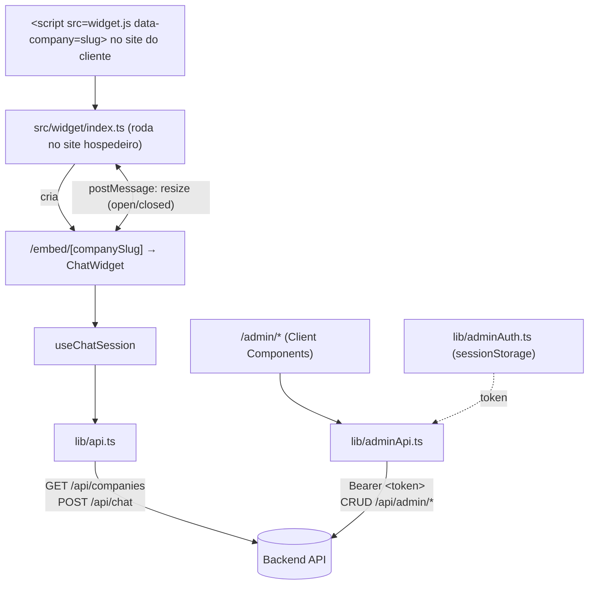

# Frontend — Widget de chat + Painel admin

Aplicação Next.js que entrega duas interfaces a partir do mesmo projeto: o widget de chat embutível em sites de clientes e o painel administrativo usado para cadastrar empresas e gerenciar os documentos que alimentam o RAG. Veja a visão geral do produto e como subir o projeto inteiro no [README raiz](../README.md).

## Índice

- [Arquitetura](#arquitetura)
- [Rotas](#rotas)
- [Componentes](#componentes)
- [Estado e dados](#estado-e-dados)
- [Estilos](#estilos)
- [Integração com a API](#integração-com-a-api)
- [Acessibilidade e performance](#acessibilidade-e-performance)
- [Rodando isoladamente](#rodando-isoladamente)
- [Testes](#testes)
- [Build de produção](#build-de-produção)

## Arquitetura

```
src/
├── app/
│   ├── page.tsx                              # "/" — redireciona para /admin
│   ├── embed/[companySlug]/                   # widget, renderizado dentro do <iframe>
│   └── admin/
│       ├── login/page.tsx                     # login (rota pública)
│       └── (protected)/                       # route group com guarda de autenticação
│           ├── layout.tsx                     # AuthGuard client-side + navegação
│           ├── page.tsx                       # lista de empresas
│           └── companies/
│               ├── new/page.tsx                # criar empresa
│               └── [slug]/page.tsx              # editar empresa + documentos
├── components/
│   ├── chat/         # ChatWidget e subcomponentes do widget
│   └── admin/         # CompanyForm, DocumentManager e primitivos de UI (admin/ui/)
├── hooks/
│   ├── useChatSession.ts        # estado da conversa (reducer: idle/sending/error + retry)
│   └── usePostMessageBridge.ts  # comunicação com o script pai (widget.js) via postMessage
├── lib/
│   ├── api.ts          # cliente HTTP público: /api/companies, /api/chat
│   ├── adminAuth.ts     # token do admin em sessionStorage (get/set/clear/isAuthenticated)
│   ├── adminApi.ts      # cliente HTTP do painel: /api/admin/*, trata 401 globalmente
│   ├── contrastColor.ts  # calcula texto preto/branco legível sobre a cor da empresa (WCAG)
│   └── types.ts          # tipos compartilhados entre lib/api.ts, hooks e componentes de chat
└── widget/
    ├── logic.ts    # funções puras usadas pelo loader (parseConfig, isTrustedMessage, computeIframeCss)
    └── index.ts    # bootstrap do loader (efeito no DOM), ponto de entrada compilado em public/widget.js
```

`public/widget.js` não é parte do build do Next: `npm run build:widget` compila `src/widget/index.ts` com esbuild para um IIFE sem dependências, que qualquer site cliente carrega via `<script>` sem passo de build próprio.

Toda a árvore sob `app/` é renderizada no cliente: as páginas de chat e do painel admin são Client Components (`"use client"`) que buscam dados em `useEffect` contra a API do backend — não há `fetch` em Server Component, `generateStaticParams`, ISR (`revalidate`) nem `getServerSideProps`. O Next.js aqui contribui roteamento por arquivo, code-splitting por rota e o bundler de produção; o carregamento de dados é inteiramente client-side.



## Rotas

| Rota | Arquivo | Renderização | Autenticação | Descrição |
|---|---|---|---|---|
| `/` | `src/app/page.tsx` | Server Component (`redirect`) | não | Redireciona para `/admin` |
| `/embed/[companySlug]` | `src/app/embed/[companySlug]/page.tsx` + `layout.tsx` | Server wrapper + `ChatWidget` (Client Component) | não | Renderiza o widget de chat dentro do `<iframe>` gerado por `widget.js` |
| `/admin/login` | `src/app/admin/login/page.tsx` | Client Component | pública | Formulário de login do admin (email + senha) |
| `/admin` | `src/app/admin/(protected)/page.tsx` | Client Component, sob `(protected)/layout.tsx` | JWT (guarda client-side) | Lista de empresas cadastradas, com contagem de documentos |
| `/admin/companies/new` | `src/app/admin/(protected)/companies/new/page.tsx` | Client Component | JWT | Formulário de criação de empresa |
| `/admin/companies/[slug]` | `src/app/admin/(protected)/companies/[slug]/page.tsx` | Client Component | JWT | Edição de empresa, gestão de documentos e exclusão |

A autenticação das rotas `(protected)` não é um middleware do Next: `layout.tsx` roda `isAuthenticated()` (verifica se há token em `sessionStorage`) dentro de um `useEffect` e redireciona para `/admin/login` se não houver token, renderizando `null` até essa checagem terminar. Além desse guard inicial, qualquer chamada de `lib/adminApi.ts` que receba `401` também limpa a sessão e redireciona — a expiração do JWT (24h, definida no backend) é tratada nesse ponto, não no guard de layout.

## Componentes

**Widget de chat** (`components/chat/`):

```
ChatWidget (orquestra estado aberto/fechado, busca a empresa, liga o hook de sessão)
├── Launcher            (botão flutuante fechado — forwardRef para foco programático)
└── ChatPanel           (painel aberto — role="dialog")
    ├── MessageList      (role="log" aria-live="polite")
    │   ├── MessageBubble
    │   └── TypingIndicator
    ├── ErrorBanner       (role="alert", com ação "Tentar novamente")
    └── Composer          (forwardRef — textarea + botão enviar)
```

**Painel admin** (`components/admin/`):

- `CompanyForm` — formulário controlado, reaproveitado por `companies/new` e `companies/[slug]` via a prop `mode: "create" | "edit"` e `onSubmit`.
- `DocumentManager` — upload/listagem/remoção de documentos de uma empresa, usado só na tela de edição.
- `admin/ui/` — primitivos compartilhados: `Button` (variantes `primary`/`secondary`/`danger`, mais o helper `buttonClassName()` para estilizar um `<Link>` do Next como botão sem aninhar `<button>` dentro de `<a>`), `Badge` (tons `neutral`/`success`/`warning`/`danger`/`info`, usado no status do documento), `StatCard` (ícone + rótulo + valor) e `ConfirmDeleteDialog` (modal que só habilita o botão de confirmar quando o usuário digita o nome exato da empresa).

Padrão de composição: componentes de apresentação recebem dados e callbacks via props tipadas (`interface ...Props`), sem acoplamento a hooks de dados — quem busca dados (`useEffect` + `lib/api.ts`/`lib/adminApi.ts`) são as páginas em `app/` ou o `ChatWidget`. `forwardRef` é usado onde o componente pai precisa mover o foco programaticamente (`Launcher`, `Composer`).

## Estado e dados

- **Cliente HTTP**: `fetch` nativo, sem biblioteca de requisição (sem Axios/SWR/React Query). `lib/api.ts` cobre as rotas públicas; `lib/adminApi.ts` cobre `/api/admin/*`, injeta o header `Authorization` a partir de `lib/adminAuth.ts` e, em qualquer resposta `401`, limpa o token e redireciona para `/admin/login` (`window.location.href`) antes de propagar o erro.
- **Cache**: não há camada de cache ou deduplicação entre navegações — cada página busca de novo no próprio `useEffect` ao montar.
- **Estado global**: não há Context API, Redux ou Zustand. O token do admin fica em `sessionStorage` (lido diretamente por `lib/adminAuth.ts`, não via React Context), e o estado de UI é local a cada componente/hook.
- **Estado da conversa**: `useChatSession` (hook com `useReducer`) modela a máquina de estados do chat — `idle` / `sending` / `error` — e guarda um `pendingRetry` (última pergunta + histórico) para o botão "Tentar novamente" reenviar exatamente a mesma requisição que falhou.
- **Loading/erro**: convenção de estado com `T | null | undefined` (`undefined` = ainda carregando, `null` = carregado mas vazio/não encontrado, `T` = pronto) em páginas como `ChatWidget` e as telas de empresa; mensagens de erro são renderizadas em `<p role="alert">`.
- **Formulários e validação**: `CompanyForm` usa Zod (`safeParse`) para validar slug (`^[a-z0-9]+(-[a-z0-9]+)*$`), cor primária (`^#[0-9a-fA-F]{6}$`), nome e persona (não vazios) antes de chamar `onSubmit`; só o primeiro erro (`issues[0].message`) é exibido por vez. O login do admin não usa Zod — valida só no backend, exibindo a mensagem de erro retornada.

## Estilos

Tailwind CSS 3.4 com classes utilitárias inline; `tailwind.config.ts` não estende o tema (`theme.extend` vazio) — não há arquivo de design tokens, paleta customizada ou tema escuro. A paleta usada é a padrão do Tailwind (`slate`, `red`, `emerald`, `amber`, `blue`), exceto pela cor de marca de cada empresa (`company.primaryColor`), aplicada via `style` inline no launcher, cabeçalho do chat e badges — nesses pontos, `lib/contrastColor.ts` calcula a cor de texto (preto ou branco) pela fórmula de luminância relativa do WCAG, para manter contraste legível independentemente da cor cadastrada. Breakpoints usados são os prefixos padrão do Tailwind (`sm:`, `lg:`, na grade de empresas do painel) — nenhum breakpoint customizado é definido. Nomenclatura de classes é utility-first (sem BEM/CSS Modules/styled-components); `postcss.config.js` só habilita `tailwindcss` e `autoprefixer`.

## Integração com a API

Os tipos das respostas do backend são mantidos manualmente neste projeto (não há geração a partir de um contrato compartilhado/OpenAPI): `lib/types.ts` define `Company`, `ChatMessage`, `ChatHistoryTurn` e os parâmetros/resultado de `POST /api/chat`; `lib/adminApi.ts` define `AdminCompany`, `CreateCompanyInput`, `UpdateCompanyInput` e `AdminDocument` inline.

A URL base é lida uma vez, no carregamento do módulo, de `process.env.NEXT_PUBLIC_API_BASE_URL` (`lib/api.ts` e `lib/adminApi.ts`), com fallback para string vazia (requisição relativa) se a variável não estiver definida.

Erros do backend chegam como `{ "error": "mensagem" }`; toda função de `lib/api.ts`/`lib/adminApi.ts` verifica `res.ok`, tenta ler esse corpo (`.json().catch(() => null)`) e lança um `Error` com a mensagem retornada ou uma mensagem padrão em português. Componentes chamadores capturam esse `Error` em `catch` e exibem `err.message` em um elemento `role="alert"` — é o mesmo caminho usado pelo formulário de empresa, pelo `DocumentManager`, pelo login e pelo `ChatWidget` (via `ErrorBanner`, que também oferece "Tentar novamente").

## Acessibilidade e performance

- **Foco e teclado**: `ChatWidget` move o foco para o campo de mensagem ao abrir e de volta para o botão flutuante ao fechar, implementa um focus trap manual (`Tab`/`Shift+Tab`) dentro do painel e fecha com `Escape`. Botões só com ícone têm `aria-label` (`"Abrir chat"`, `"Fechar chat"`, `"Editar {empresa}"`, `"Excluir {empresa}"`).
- **Semântica ARIA**: `ChatPanel` e `ConfirmDeleteDialog` usam `role="dialog" aria-modal="true"`; `MessageList` usa `role="log" aria-live="polite"` para novas mensagens serem anunciadas por leitor de tela; `TypingIndicator` usa `role="status"`; mensagens de erro usam `role="alert"`.
- **Contraste**: cor de texto sobre a cor de marca da empresa é calculada (não fixa) para atender à razão de contraste do WCAG, ver `lib/contrastColor.ts`.
- **Imagens**: logos de empresa usam `` nativo, não `next/image` — decisão registrada em comentário no código, já que os domínios de logo (URL cadastrada por empresa) não são conhecidos com antecedência para configurar `remotePatterns`.
- **Performance**: não há uso de `next/image`, `next/font` ou `dynamic import`/lazy loading no código — não há otimizações de Core Web Vitals implementadas além do que o Next.js e o Tailwind fazem por padrão.

## Rodando isoladamente

```bash
cd frontend
cp .env.example .env.local   # NEXT_PUBLIC_API_BASE_URL apontando pro backend
npm install
npm run dev                  # http://localhost:3000
```

O backend precisa estar rodando (ver [backend/README.md](../backend/README.md)), por padrão em `http://localhost:3333`. Para usar o painel admin, o backend também precisa ter `ADMIN_EMAIL`/`ADMIN_PASSWORD_HASH`/`JWT_SECRET` configurados.

Para testar o widget embutido manualmente:

```bash
npm run build   # gera public/widget.js e o build do Next
npm run dev      # ou npm start após o build
```

Abra `http://localhost:3000/demo.html` — página estática (`public/demo.html`) simulando o site de um cliente com o widget já embutido; troque o atributo `data-company` da tag `<script>` no arquivo para testar outra empresa.

## Testes

```bash
npm test              # vitest run — Testing Library + jsdom, fetch/next-navigation mockados
npm run test:watch    # modo watch
npm run typecheck      # tsc --noEmit
npm run lint           # ESLint (next/core-web-vitals, next/typescript) — ignora public/widget.js
```

A suíte espelha a estrutura de `src/` em `tests/` (`tests/lib`, `tests/hooks`, `tests/widget`, `tests/components`, `tests/components/admin`, `tests/app/admin`) e não faz nenhuma chamada de rede real.

## Build de produção

```bash
npm run build   # build:widget (esbuild → public/widget.js) + next build
npm start        # serve o build gerado
```
